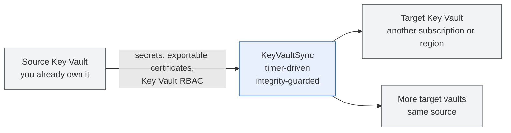

# KeyVaultSync

KeyVaultSync is a .NET 10 isolated Azure Functions application that replicates supported Azure Key Vault objects and Key Vault-specific Azure RBAC between existing vaults.

## Why KeyVaultSync

Teams that keep a second Key Vault in another region or subscription normally copy secrets, certificates, and access grants by hand or through ad-hoc scripts. That work drifts, is hard to audit, and risks overwriting a value someone else changed.

KeyVaultSync keeps a designated target vault aligned with its source on a timer, carrying both the object and the permissions that make the object usable, and refuses to write whenever it cannot prove the target is still the copy it last made.



The grey vaults are existing resources that you create and own. KeyVaultSync only reads the source and writes supported objects and role assignments into the target.

What you get:

- One authoritative source, many opted-in targets, across subscriptions in the same tenant.
- Objects and their Key Vault-specific RBAC replicated together, so a copied secret is also usable.
- HMAC-SHA256 integrity checks that skip rather than clobber anything KeyVaultSync did not last write.
- Soft deletes only, durable write intent, and structured logs for every decision.

## Opting a Vault In

The application does not create, replace, delete, or purge participating vaults. A target vault opts in by declaring its source with:

```text
sync-source-keyvault-id=<source-vault-resource-ID>
```

One source may have multiple targets. Source and target may be in different configured subscriptions, but both must be in the same tenant and use Azure RBAC authorization. The retired source-side `sync-vault-id` tag is not used.

## Supported Behavior

- Discovers target-declared mappings across every subscription in `KEYVAULTSYNC_SUBSCRIPTIONS`.
- Replicates standalone secrets with metadata and tags.
- Replicates exportable PFX certificates with policy, metadata, and tags.
- Reports standalone keys as requiring independent target provisioning and non-exportable certificates as requiring reissuance or external import because their private material cannot be exported safely through the Key Vault data plane.
- Replicates direct assignments of supported built-in Key Vault roles at vault, secret, and key ARM scopes.
- Soft-deletes managed target objects that were removed from the source when all ownership and integrity checks pass. It never purges.
- Uses a Blob lease and ETag checks for pair state and durable pending-write intents.
- Plans every admitted pair before the run performs its first mutation.
- Emits detailed structured logs and traces. Persisted private reports may contain operational identifiers; exported telemetry must not contain values or cryptographic material.

Access-policy vaults, custom role-definition replication, certificate child-scope RBAC, application failover, key rotation, and private-key replication for standalone keys are not supported.

When a target key with the same name has been independently generated or imported, KeyVaultSync can reconcile its allowlisted key-scope RBAC. It still reports the key as blocked because Azure does not expose private or symmetric material and the application cannot verify that source and target keys are cryptographically equivalent.

## Integrity and Safety

Object mutations use an HMAC-SHA256 signature over the versionless object ID, object type, name, material, managed properties, and sorted tags. The HMAC key is a protected Base64-encoded 256-bit value supplied through `KEYVAULTSYNC_HMAC_KEY`.

For an existing managed target, KeyVaultSync writes only when the current target signature matches the committed target baseline. A missing target can be created. An existing target without a compatible baseline is never adopted automatically. Each mutation:

1. persists intent;
2. performs one write or soft delete with SDK automatic retries disabled;
3. reads back and verifies the exact result;
4. commits the new baseline and clears intent.

Timeouts, cancellation after intent creation, throttling, and uncertain verification leave the intent unresolved for operator review; the operation is not retried automatically. Keep KeyVaultSync as the only writer for managed target objects.

Set `KeyVaultSyncDisabled=true` on either vault to pause a mapping.

## Requirements

- .NET 10 SDK.
- Azure Functions Core Tools v4 for local host execution.
- Azure CLI and Azure Developer CLI for deployment.
- Azurite for local Functions host storage.
- Existing Azure RBAC-enabled source and target vaults.
- Blob state storage and the required scoped permissions.

## Local Development

For a reproducible setup, open the repository in VS Code and choose **Reopen in Container**. The feature-based [development container](.devcontainer/devcontainer.json) provides the .NET 10 SDK, the latest Azure CLI and Bicep, the stable Azure Developer CLI, Azure Functions Core Tools v4, PowerShell, and project VS Code extensions. It runs Microsoft's official Azurite image as a local sidecar; credentials, local settings, and package restore remain your responsibility.

Copy [local.settings.example.json](src/KeyVaultSync.Function/local.settings.example.json) to ignored `local.settings.json` and replace placeholders privately. Never commit credentials, HMAC keys, connection strings, tenant/subscription IDs, object values, or private keys.

```sh
dotnet restore
dotnet build src/KeyVaultSync.Function/KeyVaultSync.Function.csproj
dotnet test tests/KeyVaultSync.Runner.Tests/KeyVaultSync.Runner.Tests.csproj
bash tests/grant-keyvault-access.tests.sh
bash tests/prepare-deployment.tests.sh
bash tests/postdeploy-keyvault-access.tests.sh
pwsh -NoProfile -File tests/Grant-KeyVaultAccess.Tests.ps1
pwsh -NoProfile -File tests/Prepare-Deployment.Tests.ps1
pwsh -NoProfile -File tests/PostDeploy-KeyVaultAccess.Tests.ps1
```

In the Dev Container, use **Run and Debug** → **.NET: Attach to KeyVaultSync Function** to start the local Function host, select its isolated .NET worker, and attach the debugger; the Azurite sidecar is already running. Outside the container, start Azurite before launching the debugger. The repository verification task is available as **Tasks: Run Task** → **KeyVaultSync: Verify repository**.

See [local development](doc/local-development.md) and [settings](doc/settings.md).

## Key Vault Access Setup

The onboarding scripts accept the deployed user-assigned managed identity and a target vault. They read `sync-source-keyvault-id`, validate both vaults, and preview these direct built-in grants:

| Scope | Role |
|---|---|
| Source vault | Key Vault Administrator |
| Source vault | Key Vault Data Access Administrator |
| Target vault | Key Vault Administrator |
| Target vault | Key Vault Data Access Administrator |

The source administrator grant is intentionally broad: it permits the data-plane
reads and backup operations needed for supported object replication, but it also
permits source data-plane writes and deletes. The source Data Access Administrator
grant is not used by the runtime, which writes role assignments only at target
scope; it is granted so operators can manage source Key Vault role assignments
with the same identity. No permission is changed unless `--apply` or `-Apply` is
supplied. Azure does not allow a role to export a non-exportable key or
certificate private key.

```sh
bash scripts/grant-keyvault-access.sh \
  --identity-id "<uami-resource-id>" \
  --target-vault-id "<target-vault-resource-id>"
```

The command above is preview-only. Add `--apply` after reviewing the plan to
create only the missing assignments:

```sh
bash scripts/grant-keyvault-access.sh \
  --identity-id "<uami-resource-id>" \
  --target-vault-id "<target-vault-resource-id>" \
  --apply
```

```powershell
.\scripts\Grant-KeyVaultAccess.ps1 `
  -IdentityResourceId "<uami-resource-id>" `
  -TargetVaultResourceId "<target-vault-resource-id>"
```

The PowerShell command is also preview-only. Add `-Apply` to create the missing
assignments:

```powershell
.\scripts\Grant-KeyVaultAccess.ps1 `
  -IdentityResourceId "<uami-resource-id>" `
  -TargetVaultResourceId "<target-vault-resource-id>" `
  -Apply
```

The scripts never change mapping tags, access policies, authorization mode, role definitions, or vault objects. Bash requires `jq`; PowerShell uses built-in JSON parsing.

Interactive `azd deploy`/`azd up` runs an optional post-deploy hook that discovers target-declared mappings across the configured subscriptions, previews every grant, and asks again before applying. Non-interactive deployments skip this optional workflow. Rerun it with `azd hooks run postdeploy`.

See [identity and RBAC](doc/identity-and-rbac.md).

## Infrastructure and Deployment

[azure.yaml](azure.yaml) and [main.bicep](infra/main.bicep) deploy the Function, Flex Consumption plan, user-assigned managed identity, host/deployment/state storage, telemetry, and infrastructure role assignments. They do not deploy participating Key Vaults.

The deployment grants the runtime identity Reader in every configured discovery subscription. Provisioning therefore requires permission to create those subscription-scoped role assignments.

```sh
azd auth login
azd env new <environment> --subscription <deployment-subscription-id> --location <region>
azd provision --preview
azd up
```

The shared deployment-preparation hook runs before both provisioning and package deployment. `azd` defers HMAC initialization to this hook instead of collecting the secure Bicep parameter first. For a new environment it shows one hidden prompt: paste an existing Base64-encoded 256-bit key, or press Enter to generate one securely. The generated or supplied key is saved once; the predeploy invocation reuses it without prompting or rotating it. Interactive option selections use numbered menus, with Enter accepting the displayed default. An invalid saved key can be interactively replaced only after the replacement passes validation. The ignored `.azure/<environment>/.env` contains sensitive plaintext configuration and must be protected.

If `AZURE_RESOURCE_GROUP` is not already configured, the preprovision hook asks for a three-letter Azure region abbreviation such as `eun` for North Europe or `swc` for Sweden Central, then persists the CAF-style name `rg-keyvaultsync-<region>-<environment>` for azd to create. An explicitly configured resource-group name is preserved. Generated solution-resource names reuse a deterministic Bicep token derived from the deployment subscription ID, normalized azd environment name, and Azure location.

State Blob versioning and 14-day soft-delete retention are enabled. One networking profile selects public endpoints (the default), a private deployment with a dedicated KeyVaultSync network, or a private deployment attached to existing enterprise networking. The managed-private path offers the documented network topology as one default choice and prompts for individual values only when customization is selected. Private profiles privatize KeyVaultSync storage and monitoring and integrate the Function with the selected subnet. They do not create private endpoints or network resources for participating source and target vaults; customer infrastructure must make those vaults reachable from the Function. See [networking](doc/networking.md).

## Documentation

- [Architecture](doc/architecture.md)
- [Code flow](doc/code-flow.md)
- [Configuration](doc/settings.md)
- [Deployment](doc/deployment.md)
- [Networking](doc/networking.md)
- [Identity and RBAC](doc/identity-and-rbac.md)
- [Observability](doc/observability.md)
- [Troubleshooting](doc/troubleshooting.md)
- [Coding guide](doc/coding-guide.md)

Unit tests, mocked script tests, builds, and Bicep compilation do not prove live Azure permissions, telemetry ingestion, or mutation safety. Validate live behavior only in an explicitly approved disposable scope.

## License

This project is licensed under the [MIT License](LICENSE).
