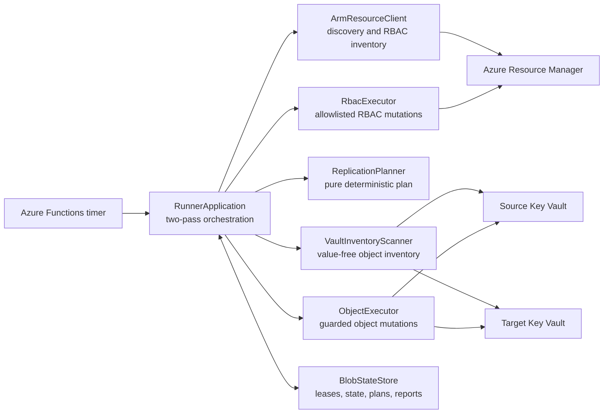
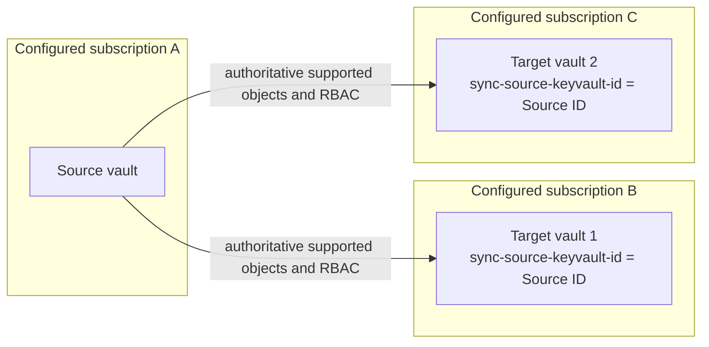
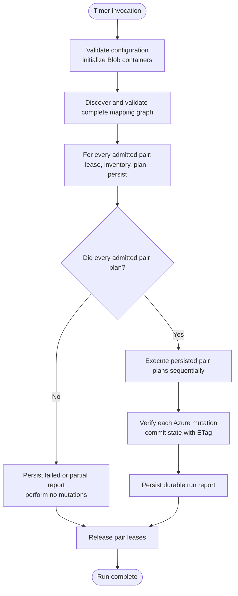
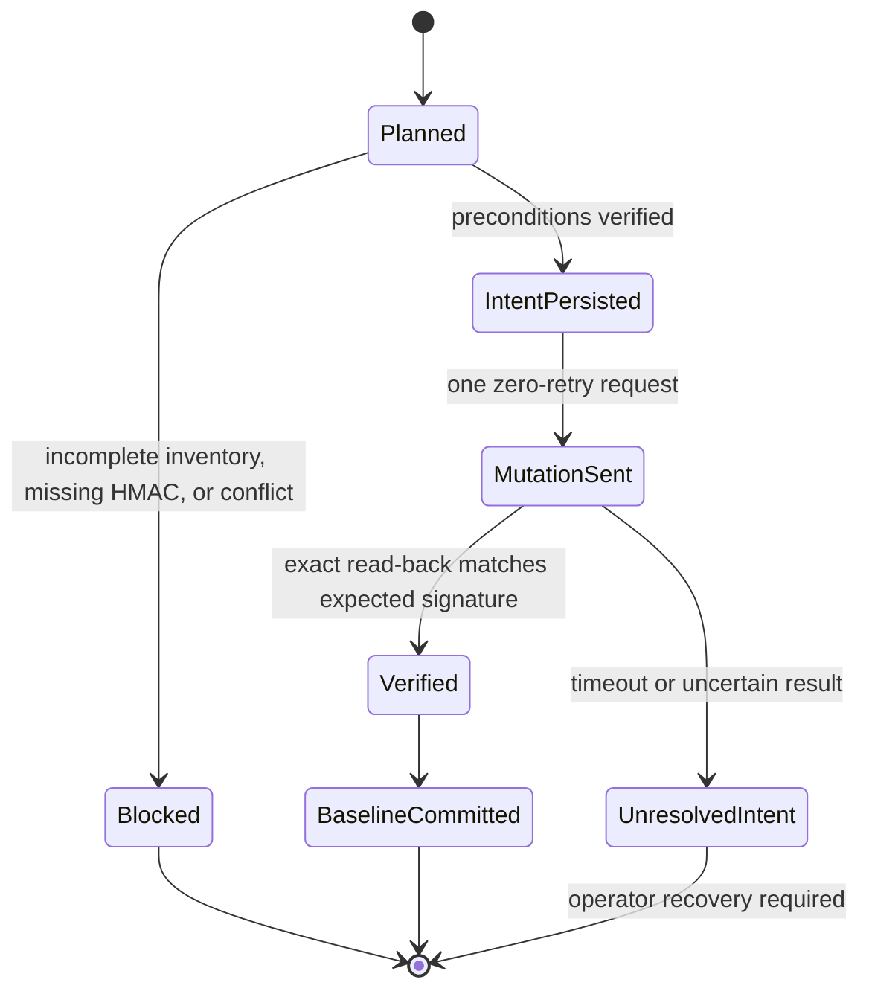

# KeyVaultSync Architecture

## System View



The arrows show runtime dependencies, not resource ownership. In particular, application infrastructure does not own the participating vaults.

## Components

- **KeyVaultSync.Function** is a thin .NET 10 isolated timer host.
- **RunnerApplication** owns discovery, admission, planning, execution, reporting, and pair coordination.
- **ArmResourceClient** performs read-only multi-subscription discovery and declared-authorization inventory.
- **VaultInventoryScanner** produces value-free active and soft-deleted object inventories.
- **ReplicationPlanner** is deterministic and performs no Azure mutation.
- **ObjectExecutor** owns guarded secret/certificate creation, reconciliation, and soft deletion.
- **RbacExecutor** owns supported direct role-assignment creation and deletion.
- **BlobStateStore** owns pair leases, ETag-guarded state, pending intents, plans, checkpoints, and run reports.

There is no Storage Queue. One timer invocation performs the complete workflow directly.

## Mapping Graph

The runtime lists Key Vaults across all GUIDs in `KEYVAULTSYNC_SUBSCRIPTIONS`, combines the results, and then validates the complete graph. A target declares:

```text
sync-source-keyvault-id=<source-vault-resource-ID>
```

One target has one source; one source may have multiple targets. Discovery rejects unreadable endpoints, self-maps, chains, cycles, cross-tenant pairs, and pairs where either vault is not Azure RBAC-enabled. `KeyVaultSyncDisabled=true` on either endpoint suppresses the pair.

The application never creates, replaces, deletes, or purges source or target vaults.



## Run Lifecycle

KeyVaultSync uses a two-pass run:

1. validate configuration and initialize Blob state;
2. discover and validate all mappings;
3. acquire a lease for each admitted pair;
4. inventory source/target objects and direct supported RBAC;
5. plan and persist every admitted pair;
6. if any admitted pair could not plan, perform no mutations;
7. execute already-persisted plans sequentially;
8. verify every mutation and atomically update pair state;
9. persist the durable run report and release all leases.



Execution order within a pair is:

1. vault-scope RBAC creates;
2. object creates/reconciles;
3. eligible object-scope RBAC creates;
4. eligible object-scope RBAC deletes;
5. object soft deletes;
6. vault-scope RBAC deletes.

Vault RBAC can converge even when object HMAC material is unavailable. Object-scope RBAC requires its object prerequisite to be verified or eligible for a managed deletion.

## Objects

### Secrets

The executor reads the exact planned source version and writes one new target version. Content type, enabled state, validity dates, and tags are included.

### Certificates

Only exportable PFX certificates are replicated. The exact backing secret supplies the PFX while certificate metadata and the current certificate policy provide the remaining signature/import fields. The certificate's backing secret and key names are suppressed from independent planning. PEM and non-exportable certificate material are blocked explicitly.

The integrity signature for a certificate covers the canonical policy encoding and the DER-encoded X.509 certificate. It deliberately excludes the PKCS#12 container: Key Vault re-encodes PFX payloads non-deterministically, so identical certificates export different bytes from each vault. Signing those bytes would make post-write verification fail for every replicated certificate. Key-pair equivalence is implied by the certificate itself, because Key Vault only returns a certificate whose stored private key matches its public key.

### Keys

Standalone private or symmetric key material cannot generally be exported from Key Vault. A missing target key is reported as requiring independent generation or external import. When a target key with the same name already exists, allowlisted key-scope RBAC can converge, but the key remains blocked because the application cannot verify cryptographic equivalence. Backup/restore is not used as a general cross-subscription replication protocol.

## Object Integrity

The versioned signature contract uses HMAC-SHA256 over length-prefixed canonical fields including versionless object ID, type, name, material, managed properties, and sorted tags. Source and target signatures differ because their IDs differ.

An existing managed target may be overwritten only when its live signature matches the committed target baseline. A missing target may be created. An existing target without a compatible baseline is a conflict and is never adopted automatically.

Before mutation, the executor persists an intent. Target SDK retries are disabled. After one mutation it verifies the exact result before committing the baseline and clearing intent. Ambiguous outcomes retain intent and block automatic retry.



## Deletion

Deletion means Key Vault soft delete only; purge is never called. A target-only object is eligible only when:

- source and target inventories are complete;
- a compatible managed baseline proves ownership;
- the live target signature still matches that baseline;
- the source object is absent;
- no pending intent exists;
- the run's deletion circuit breaker is closed or an exact one-use approval exists.

The current circuit breaker opens at 10 planned object deletions or 25% of managed baselines. Treat these as conservative safety defaults, not proof that a deletion batch is safe.

## RBAC

The planner compares direct allowlisted built-in Key Vault role assignments at vault, secret, and key ARM scopes. Ancestor assignments are context only. Conditions and condition versions are preserved. Custom role definitions are not created. Certificate child-scope RBAC is unavailable in ARM and is reported as degraded.

## State and Concurrency

Pair state stores object baselines, mutation intents, approvals, and checkpoints. Empty compatible state may advance to the current schema; incompatible non-empty baseline or intent state fails closed and requires explicit administrative handling.

Blob leases and ETags coordinate KeyVaultSync runs. Leases are held from planning through execution so state cannot change between passes. They do not fence external Key Vault writers, so the operational single-writer requirement remains.

## Observability and Privacy

Runs emit structured events, W3C activities, metrics, and durable private reports. Secret values, PFX/private-key material, HMAC keys/signatures, credentials, and connection strings must never appear in logs, traces, metrics, or reports.

Persisted private reports may include operational IDs needed for review. Exported telemetry should use stable keyed correlation identifiers rather than raw vault names, object names, ARM IDs, or principal IDs. Full correlation-key sanitization remains an operational hardening requirement.
