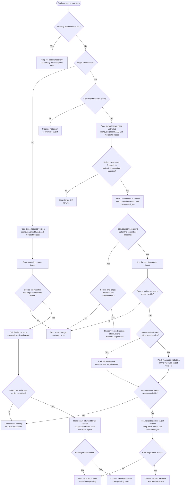
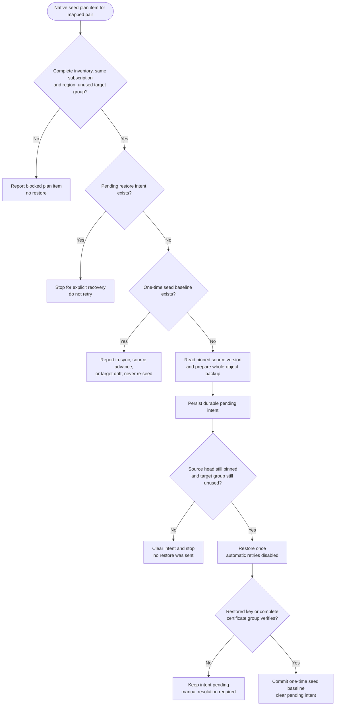

# KeyVaultSync Code Flow

## Current Runtime

The implementation includes a .NET 10 console runner and a .NET isolated Timer Trigger Function wrapper. Both forms call the same orchestration and domain services; the console runner remains useful for local and lab scans.

## Startup

1. `RunnerOptions.Parse` reads explicit CLI arguments first, then the corresponding environment variables. Subscription ID and Blob endpoint are required; there are no lab-specific endpoint defaults.
2. `DefaultAzureCredential` is created once and used for ARM, Key Vault, Blob Storage, and Azure Monitor Entra-authenticated ingestion.
3. `TelemetryRuntime.Configure` creates the OpenTelemetry resource, structured console logger, trace provider, metric provider, and Azure Monitor exporters when `APPLICATIONINSIGHTS_CONNECTION_STRING` is present.
4. `BlobStateStore.InitializeAsync` ensures the private state and run-history containers exist.
5. The optional versioned HMAC key is read from protected Function App application settings or local environment configuration. If it is absent, secret plan items are blocked and reported; eligible native key/certificate seeds are still evaluated. Malformed HMAC configuration fails initialization.

## Run and Pair Flow

```text
Parse settings
  -> configure telemetry and credentials
  -> create/verify Blob containers
  -> load optional HMAC key
  -> write initial run record
  -> discover subscription Key Vaults, source-side sync-vault-id and target-side sync-source-keyvault-id mappings, and KeyVaultSyncDisabled opt-outs
  -> for each pair: acquire Blob lease
       -> scan source and target inventories
       -> create plan from inventory + committed PairState
       -> automatically execute eligible guarded secret writes when HMAC is configured
       -> automatically execute eligible one-time native key/certificate-group seeds
       -> save complete-scan checkpoint and final run record
  -> flush telemetry providers
```

Each pair is serialized by a lease on `pairs/{sha256(pairId)}.json`. The lease is renewed while work runs. State updates use both the lease ID and ETag. A failed inventory cannot advance `LastCompleteRunId` or act as deletion evidence.

The timer is the authoritative change and deletion detector. Key Vault Event Grid notifications cover events such as new versions and expiry, but the documented event catalog has no object-deletion event. Event delivery can also be delayed, duplicated, or out of order. A complete active/soft-deleted inventory is therefore required before interpreting absence or advancing the checkpoint. Event Grid may be added as an optional early-scan hint, never as a replacement for reconciliation.

## Inventory and Planning

`VaultInventoryScanner` lists active and soft-deleted secret, key, and certificate names. Secret values are not fetched during routine inventory. The scanner records current/version metadata, certificate public fingerprints and backing references, authorization declarations, and warnings. Each category is a child span of the vault inventory activity.

ARM discovery accepts `sync-vault-id=<target-vault-resource-ID>` on a source or `sync-source-keyvault-id=<source-vault-resource-ID>` on a target. The reverse tag allows multiple targets per source. If both tags declare the same edge, discovery collapses the duplicate; it rejects conflicting owners of one target and chained/cyclic mappings. A pair is admitted only when neither vault has the resource tag `KeyVaultSyncDisabled=true`. A disabled source or target is recorded as an intentional suppressed pair, without a mapping issue, pair lease, Key Vault data-plane read, checkpoint advance, or write. Removing the tag or changing its value away from `true` allows the next run to consider the pair again.

`SyncPlanner` is read-only. It detects missing, changed, unbaselined, soft-deleted, and unresolved-write cases, and proposes one-time native seeds only when inventory, scope, and target-name checks allow them. A missing secret target with a previous baseline is a conflict, not permission to recreate. Certificate-backed secrets are owned by the certificate group and cannot enter generic secret sync. Legacy access policies are compared by normalized principal and permission sets; RBAC reports that its inventory does not resolve all effective permissions.

## Secret Synchronization Safety

An enabled, unpaused source/target mapping automatically opts the pair into supported operations. Only secret plan items with a safe status enter `SecretSyncExecutor`. Secret writes require:

- A stable random 256-bit HMAC key in protected Function App or local environment configuration, with a non-secret key version label. If the key is missing, secret actions are blocked and eligible native seeds are still evaluated.
- A target secret name that is absent from active and soft-deleted inventory, or whose current value HMAC and managed-metadata digest match the committed baseline. An Azure version-ID change alone is not target drift; version observations are rechecked separately as concurrency guards.
- The operator must ensure this runner is the sole writer to target objects being changed. This is an operational permission requirement, not a runtime acknowledgment switch; Key Vault writes have no compare-and-set condition.

`KeyVaultSyncDisabled=true` on either mapped vault is the per-pair pause control. Remove or change that tag only when automatic operations are intended to resume. Onboarding `--apply` / `-Apply` approves IAM changes only; it is not a runtime synchronization switch.

Secret value fingerprints use HMAC-SHA-256 with the configured 256-bit key over a versioned, length-prefixed UTF-8 encoding of the directional pair ID, `Secret` object type, secret name, and plaintext value. This is an integrity fingerprint, not encryption. A separate SHA-256 metadata digest covers enabled state, content type, validity timestamps, and tags. Neither fingerprint contains an Azure version ID. The committed baseline stores these fingerprints and version observations, not the value or HMAC key.

For an existing target, the executor first compares the current target value HMAC and managed-metadata digest with the committed baseline. Either mismatch blocks the write; an existing target without a baseline is never adopted. If both still match and the source fingerprints are unchanged, it rechecks both heads and refreshes version observations without writing. If only source metadata changed, it patches properties on the validated target version. If the source value changed, it creates one new target secret version with `SetSecret`.

Before mutation, the executor stores a durable `PendingSecretWrites` intent under the pair lease and rechecks source and target state. `SetSecret` has no compare-and-set condition, so automatic retries are disabled. The executor reads the exact returned target version and verifies both fingerprints before committing the new baseline. If the mutation outcome is uncertain or verification fails, the intent remains and future runs block the name; they never retry automatically.

### Current Secret Synchronization Decision Flow



The saved target HMAC and metadata digest answer whether the target still contains the logical value and managed properties last written and verified by KeyVaultSync. A different Azure version ID is not target drift when both fingerprints still match. If either current target fingerprint differs, KeyVaultSync treats the target as changed and never overwrites it automatically.

### One-Time Native Key and Certificate-Group Seed Flow

An enabled, unpaused mapping automatically evaluates the one-time native backup/restore executor; it does not require the secret HMAC key. The pair must have source backup and target restore permissions, and the operator must ensure this runner is the sole writer to target objects being changed. The planner requires complete inventory, the same subscription and region, and an unused target name across active key, certificate, and secret namespaces and soft-deleted names. A certificate is treated with its same-name backing key/secret references as one group; certificate-backed secrets do not enter standalone-secret synchronization.

Each eligible key or certificate group can be seeded once. The executor pins and rechecks the source, creates a durable pending intent, restores the whole-object backup once, and verifies the restored public fingerprints and group references before committing a baseline. Backups stay in process memory and are cleared after use. A pending intent, existing baseline, target collision, or changed target group blocks another restore; an ambiguous restore remains pending for manual resolution and is never retried automatically. Later source versions are not propagated as rotation, and target drift is review-only.



Delete/purge and authorization writes remain unimplemented and plan-only.

## Run Outcome

- `AutomaticSync`: the single run mode for every cycle, including cycles with no mapped pairs.
- Pair `SyncCompleted`: inventory, planning, and supported synchronization completed with no unapplied work.
- Pair `SyncCompletedWithUnappliedWork`: inventory completed and the checkpoint was saved, but plan items remain blocked or unsupported; the aggregate run is marked `Partial`, the console exits nonzero, and the timer logs a warning. Missing HMAC for standalone secret items is one example.
- Pair `PartialInventory`: inventory/read warnings prevented the complete-scan checkpoint from advancing. The aggregate run is marked `Partial`.
- Pair `SkippedPairAlreadyLocked` or `Failed`: that pair did not complete; the aggregate run is marked `Partial`.
- `Complete`: every admitted pair completed without unapplied work and there were no mapping issues.
- `NoConfiguredPairs`: no enabled pair was admitted; this is a normal no-op when pairs are absent or intentionally suppressed by `KeyVaultSyncDisabled=true`.
- Run `Partial`: discovery reported issues or at least one pair did not have `SyncCompleted` status. Inspect each pair status: a complete-inventory pair with unapplied plan items may still have saved its checkpoint, while `PartialInventory` did not.
- Run `Failed` or `Cancelled`: discovery/orchestration failed or the host cancelled the cycle. The console exits nonzero; cancellation propagates to the timer host.

The timer logs partial or unapplied work for operator attention and throws on `Failed` or `Cancelled`. The full durable run record is written to `keyvaultsync-runs`; it includes disabled-pair count and vault names. Console output contains a summary and plan, not secret values.
