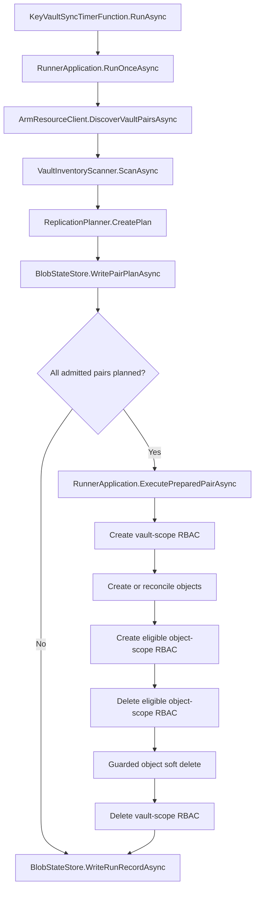
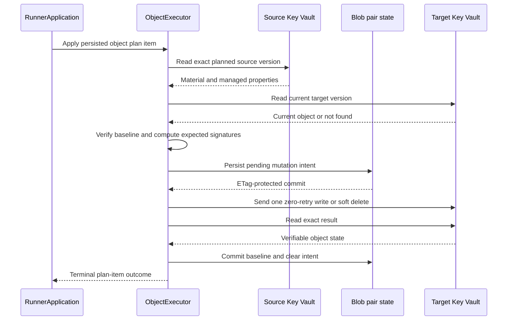

# KeyVaultSync Code Flow

## End-to-End Control Flow

## Timer Entry

`KeyVaultSync.Function` creates `RunnerApplication` and invokes it from the timer trigger. Runtime configuration is environment-only.

## Discovery

`ArmResourceClient` lists vaults from every configured subscription and builds one graph from target-side `sync-source-keyvault-id` tags. Graph validation completes before any data-plane inventory or mutation.

## Plan Pass

For each admitted pair, `RunnerApplication`:

1. acquires the pair Blob lease;
2. loads schema-compatible pair state;
3. inventories source and target objects without reading values;
4. inventories direct vault/secret/key RBAC declarations;
5. invokes pure `ReplicationPlanner`;
6. persists the complete plan.

Leases remain held. If any admitted pair cannot complete this pass, no prepared pair mutates Azure.

## Execution Pass

Plans execute sequentially in this order:

1. vault-scope RBAC creates;
2. secret and certificate creates/reconciles;
3. verified object-scope RBAC creates;
4. eligible object-scope RBAC deletes;
5. guarded object soft deletes;
6. vault-scope RBAC deletes.

Each item produces an explicit applied, skipped, blocked, conflict, failed, or ambiguous outcome in the run report.

## Guarded Object Mutation

`ObjectExecutor`:

1. reads the exact source version named by the plan;
2. computes the versioned source and expected-target signatures;
3. reads the current target when present;
4. requires its signature to match the committed baseline;
5. persists an object mutation intent;
6. performs one zero-retry write or delete;
7. reads back the exact result;
8. commits the new baseline and clears intent only after verification.

Uncertain outcomes retain intent and block later automatic mutation. Cancellation is propagated.

Secrets are written directly. Exportable PFX certificates are imported with policy and metadata. A standalone key is reported as requiring independent target provisioning; if a same-named target key already exists, its allowlisted key-scope RBAC can converge even though cryptographic equivalence remains unverifiable. Non-exportable certificates are reported as requiring reissuance or external import.

## RBAC Mutation

`RbacExecutor` accepts only allowlisted built-in Key Vault roles. `ArmRbacClient` creates/deletes deterministic direct assignments, preserves conditions, and verifies the result with bounded polling. It never creates role definitions.

The runtime identity's assignment is excluded from deletion. Object-scope RBAC waits for a verified object prerequisite.

## State and Reports

`BlobStateStore` uses one lease and ETag-guarded state blob per pair. State contains:

- object baselines;
- unresolved mutation intents;
- deletion approval state;
- the last complete inventory checkpoint.

Run reports and persisted plans are separate durable records. Incompatible non-empty state fails closed instead of being silently adopted.

## Failure Boundaries

- Discovery or planning failure: no mutation starts.
- One pair execution failure: later already-planned pairs may continue.
- Definitive pre-mutation client rejection: no ambiguous outcome.
- Timeout, throttling, cancellation after intent, or verification uncertainty: retain intent.
- Incomplete inventory: suppress deletion and other absence-based decisions.
