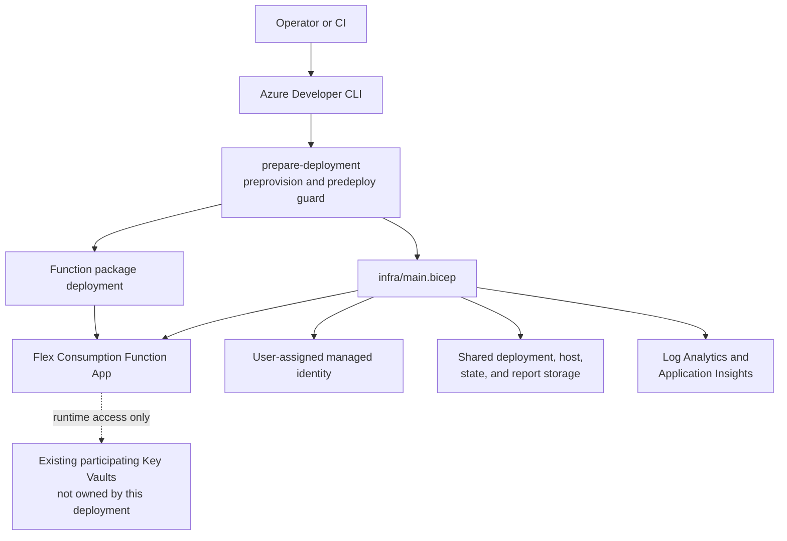
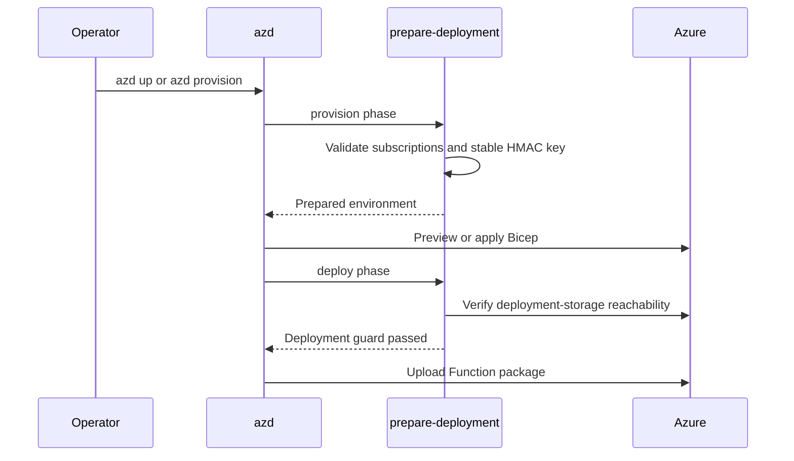

# KeyVaultSync Deployment

## Ownership Boundary

`azure.yaml` and `infra/main.bicep` deploy:

- .NET 10 isolated Function App on Flex Consumption;
- user-assigned managed identity;
- shared host/deployment/state storage;
- private state and run containers;
- Log Analytics and Application Insights;
- infrastructure role assignments.

They do not create, replace, delete, purge, retag, or change authorization mode on participating Key Vaults.



## Configuration

The azd environment must supply:

- deployment subscription and location;
- `KEYVAULTSYNC_SUBSCRIPTIONS`;
- the HMAC key;
- an explicit public/private network mode;
- private-network inputs when private mode is selected;
- optional adopted resource-name overrides;
- optional deployment tags.

Every subscription in `KEYVAULTSYNC_SUBSCRIPTIONS` is scanned as part of one mapping graph. Main Bicep grants the runtime identity Reader in each one. The provisioning identity therefore needs role-assignment permission at every listed subscription.

Each target vault declares its source with `sync-source-keyvault-id`. Cross-subscription pairs are supported when both endpoints are configured, use Azure RBAC, and share a tenant.

## Provision

```sh
azd auth login
azd env new <environment> --subscription <deployment-subscription-id> --location <region>
azd provision --preview
azd up
```

Review the preview before applying. One deployment-preparation script serves both azd phases:

- before provisioning, it validates and persists multi-subscription and network configuration, obtains or preserves the HMAC key, and optionally configures one deployment tag;
- before package deployment, it revalidates the HMAC key and confirms that Flex deployment storage is reachable through the expected public or private Blob path.

`azd` defers subscription-list and HMAC initialization to the preprovision hook, so it does not collect those Bicep parameters before the preparation logic runs. If no key exists, an interactive run asks whether to generate a cryptographically random key or supply one. Valid existing keys are reused without being displayed or rotated. An invalid saved value can be interactively replaced after warning the operator, but the replacement is persisted only after it validates as Base64 for exactly 32 bytes. Non-interactive pipelines must provide valid protected HMAC material.

The ignored `.azure/<environment>/.env` stores sensitive plaintext configuration. Protect it and backups.



## Script Surface

The operator-facing automation is three responsibilities, each implemented for Bash and PowerShell:

- `prepare-deployment.*` runs only as the azd preprovision/predeploy guard;
- `postdeploy-keyvault-access.*` discovers enabled mappings, lists each pair's source and target subscription, resource group, and vault name in a table, then coordinates optional onboarding;
- `grant-keyvault-access.*` previews or applies the three required per-pair grants.

There are no separate HMAC, storage-validation, backup/restore, or vault-mutation deployment scripts.

## Vault Onboarding

After deployment, use the target-based onboarding scripts:

```sh
bash scripts/grant-keyvault-access.sh \
  --identity-id "<uami-resource-id>" \
  --target-vault-id "<target-vault-resource-id>"
```

```powershell
.\scripts\Grant-KeyVaultAccess.ps1 `
  -IdentityResourceId "<uami-resource-id>" `
  -TargetVaultResourceId "<target-vault-resource-id>"
```

Preview is the default. `--apply`/`-Apply` is required for IAM changes. The scripts resolve the source from the target tag, support cross-subscription pairs, and require Azure RBAC on both vaults.

Interactive azd deployments can run the optional post-deploy hook. It discovers target-declared mappings in all configured subscriptions, previews every grant, and asks separately before applying. Non-interactive runs skip it.

## State Preservation

The storage account is not disposable. It contains:

- Functions host/deployment artifacts;
- pair leases and ETag-guarded state;
- object baselines and unresolved intents;
- deletion approvals;
- durable plans and run reports.

Blob versioning and 14-day soft-delete retention are enabled. Preserve the storage account, managed identity, HMAC key, and key-version label across host replacement.

Adopting an existing deployment requires compatible state and exact resource names. Incompatible non-empty state fails closed and requires explicit administrative handling.

## Networking

Public mode uses public service endpoints with Entra authorization and Shared Key disabled.

Private mode supports either a minimal dedicated VNet or supplied enterprise resources. It configures Flex Consumption VNet integration, disables public access on the Function, storage, and Application Insights, and creates private endpoints for Blob, Queue, Table, Azure Monitor, and the explicitly supplied Key Vault IDs. Managed mode creates and links private DNS zones and an Azure Monitor Private Link Scope; existing mode reuses supplied zones and scope. See [networking](networking.md) for inputs, ownership boundaries, package-deployment constraints, and validation.

## Validation

Local validation:

```sh
dotnet test tests/KeyVaultSync.Runner.Tests/KeyVaultSync.Runner.Tests.csproj --no-restore
dotnet build src/KeyVaultSync.Function/KeyVaultSync.Function.csproj --no-restore -p:GenerateDocumentationFile=true -warnaserror
az bicep build --file infra/main.bicep --outfile /tmp/keyvaultsync-main.json
```

Before live validation, confirm the exact tenant, subscriptions, resource group, regions, vault names, IAM scope, mutation approval, retention period, and cleanup boundary. Create disposable test vaults separately from application Bicep. Never purge them as part of automated validation.

A successful deployment or build is not proof of effective permissions, telemetry ingestion, or safe mutation.
