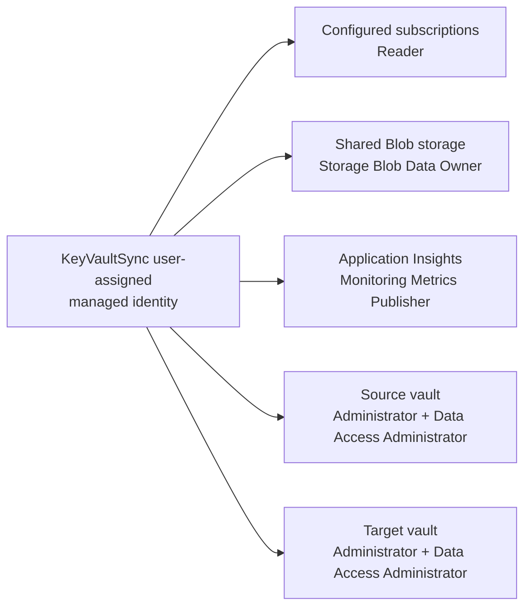
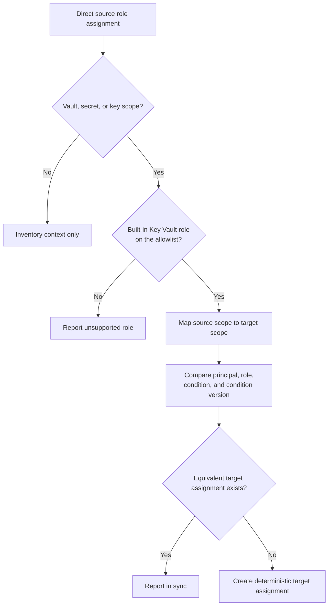

# KeyVaultSync Identity and RBAC

## Authorization Flow

Infrastructure grants the top three relationships. The explicit onboarding scripts preview and optionally create the source/target vault relationships.

## Runtime Identity

The Function uses one user-assigned managed identity selected by `AZURE_CLIENT_ID`. `DefaultAzureCredential` is retained so local development can use Azure CLI authentication. Do not configure competing client-secret or certificate credentials.

The identity is also used for Functions host storage, pair state, run history, ARM discovery, Key Vault operations, RBAC reconciliation, and Entra-authenticated telemetry. Preserve it across deployments: recreating the identity changes its principal ID and requires assignment updates.

## Infrastructure Grants

The Bicep deployment grants the runtime identity:

| Scope | Role | Purpose |
|---|---|---|
| Every subscription in `KEYVAULTSYNC_SUBSCRIPTIONS` | Reader | Discover vaults and inspect ARM metadata and direct role assignments. |
| Shared storage account | Storage Blob Data Owner | Function deployment/host access plus state, leases, ETags, and run reports. |
| Application Insights | Monitoring Metrics Publisher | Managed-identity telemetry ingestion. |

Creating Reader assignments in every configured subscription requires the provisioning identity to have role-assignment permission at those scopes.

The application Bicep never creates or modifies participating vaults and does not automatically grant vault data-plane or authorization-management access.

## Pair Onboarding

The Bash and PowerShell onboarding scripts accept the runtime UAMI resource ID and the target vault resource ID. They:

1. read `sync-source-keyvault-id` from the target;
2. resolve the source, including cross-subscription mappings;
3. require both vaults to use Azure RBAC and share the runtime identity's tenant;
4. preview direct built-in assignments;
5. apply them only after `--apply` or `-Apply`.

| Scope | Built-in role |
|---|---|
| Source vault | Key Vault Administrator |
| Source vault | Key Vault Data Access Administrator |
| Target vault | Key Vault Administrator |
| Target vault | Key Vault Data Access Administrator |

The source administrator role permits the supported object replication reads and Key Vault backup operations for keys, secrets, and certificates. It is broader than a read-only role and therefore also permits source data-plane writes and deletes. The target administrator role permits supported object replication.

Key Vault Data Access Administrator carries no data actions at all. It grants `Microsoft.Authorization/roleAssignments/write` and `/delete`, constrained by an ABAC condition to the built-in Key Vault data roles. On the target vault it is required, because the runtime creates and deletes target role assignments. On the source vault the runtime never uses it: every mutation path takes a target scope only. It is granted there solely so operators can manage source Key Vault role assignments with the same identity, and it permits granting any built-in Key Vault data role on the source vault to any principal. Grant it only where that authority is intended. The Data Access Administrator assignment is an operational permission and is excluded from source-to-target replication.

The scripts never modify tags, access policies, vault authorization mode, role definitions, objects, or unrelated assignments.

## Replicated Assignments

Only direct assignments of these built-in roles are eligible:

- Key Vault Administrator
- Key Vault Certificates Officer
- Key Vault Certificate User
- Key Vault Crypto Officer
- Key Vault Crypto Service Encryption User
- Key Vault Crypto User
- Key Vault Reader
- Key Vault Secrets Officer
- Key Vault Secrets User

Eligible scopes are:

- vault;
- secret child ARM resource;
- key child ARM resource.

Azure does not expose an equivalent certificate child ARM scope, so certificate-specific authorization degrades to vault scope and is reported. Subscription, resource-group, and management-group assignments are inventory context only and are not copied. Custom role definitions are not created or replicated.

The planner preserves principal ID, principal type, role, condition, and condition version. A condition is never dropped because that could widen access. Assignment IDs are deterministic in the target subscription.

## Cleanup Safety

KeyVaultSync does not remove:

- its own runtime assignment;
- assignments outside the supported allowlist;
- ancestor-scope assignments;
- assignments that cannot be tied to a verified object prerequisite.

Group membership, PIM eligibility, deny assignments, and effective authorization are not expanded into direct assignments. Onboarding grants are not automatically revoked when a mapping is paused or removed.
