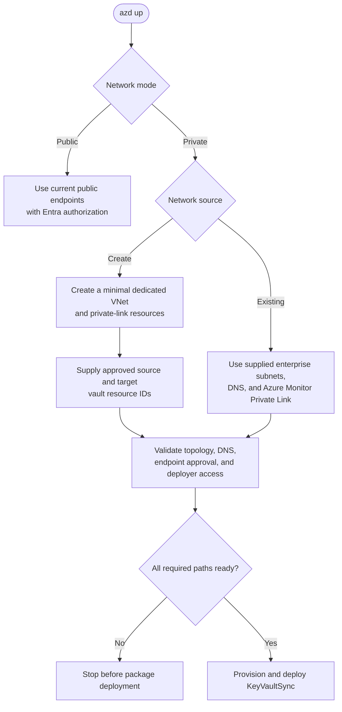
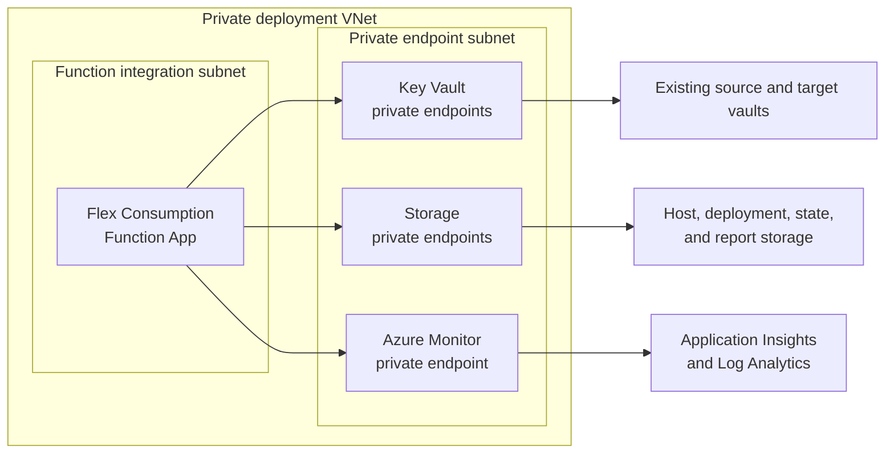
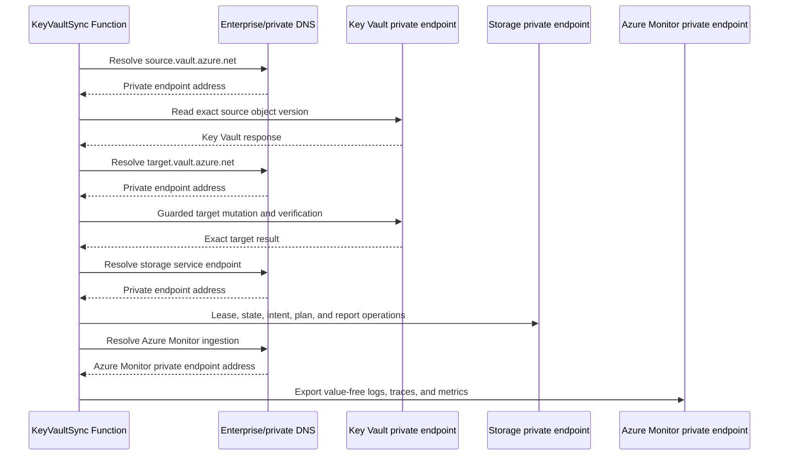
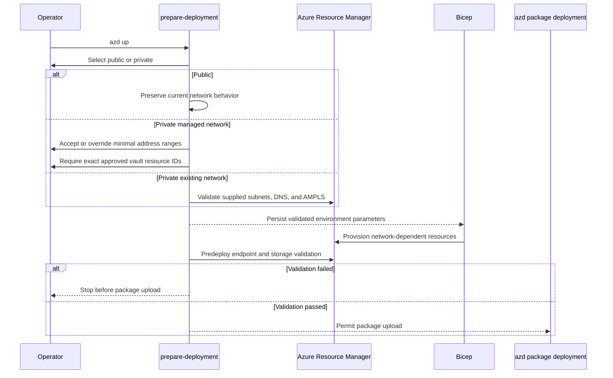

# KeyVaultSync Networking

## Status

Public and private infrastructure modes are implemented in `infra/main.bicep`, `infra/modules/private-networking.bicep`, and the deployment-preparation scripts. Public remains the default.

Private mode supports a KeyVaultSync-managed VNet or existing enterprise subnets, private DNS zones, and Azure Monitor Private Link Scope. Managed mode requires an explicit, approved list of source and target vault resource IDs; deployment does not infer or silently approve a changed vault set.

## Goals

The networking feature must:

- preserve the current public deployment as a supported option;
- offer one enterprise-private deployment option through `azd up`;
- support a minimal dedicated VNet or an existing enterprise VNet;
- reach private source and target Key Vault data-plane endpoints;
- make Function storage and Azure Monitor ingestion private in private mode;
- keep participating Key Vault lifecycle and network-policy ownership outside KeyVaultSync;
- avoid deploying a firewall, NAT Gateway, VPN, bastion, or general hub-and-spoke platform;
- fail before package deployment when required private connectivity is incomplete.

Private networking changes transport and name resolution only. It does not weaken RBAC, HMAC baselines, pending-mutation intent, exact-version verification, Blob lease/ETag checks, or the operational single-writer requirement.

## Deployment Modes



### Public

Public mode preserves the existing architecture:

- Function storage uses public endpoints with Shared Key disabled and managed-identity authorization;
- Application Insights ingestion and query endpoints are public;
- Key Vault access follows each participating vault's existing network configuration;
- no VNet integration, private endpoint, private DNS zone, or Azure Monitor Private Link Scope is created.

### Private with a managed VNet

KeyVaultSync creates only the network resources required by this deployment:

- one VNet;
- one Flex Consumption integration subnet;
- one separate private-endpoint subnet;
- private DNS zones and VNet links;
- private endpoints for mapped Key Vaults;
- private endpoints for Function storage;
- an Azure Monitor Private Link Scope and endpoint;
- Function outbound VNet integration.

The template does not create or modify source or target vaults. It creates private endpoint resources that reference explicitly confirmed vault resource IDs.

### Private with an existing VNet

KeyVaultSync uses enterprise-owned networking:

- an existing Flex integration subnet;
- an existing private-endpoint subnet;
- centrally managed private DNS zones or equivalent enterprise DNS forwarding;
- an existing Azure Monitor Private Link Scope.

The deployment validates these resources and attaches only KeyVaultSync-owned resources. It does not create parallel private DNS zones or a second monitoring private-link topology in the enterprise VNet.

## Minimum Topology

Azure Functions Flex Consumption VNet integration and private endpoints cannot share a subnet.



### Function integration subnet

The integration subnet must:

- use `/27` or larger for one Flex Consumption app;
- be delegated to `Microsoft.App/environments`;
- be in a VNet and region supported by the Function deployment;
- contain no private endpoints;
- contain no incompatible delegation;
- not use an underscore in its name;
- have sufficient unallocated addresses for Flex platform gateways.

A `/26` or larger subnet should be used when the enterprise intends to share the subnet with additional Flex apps or requires more scaling headroom.

### Private-endpoint subnet

The private-endpoint subnet must:

- be different from the Function integration subnet;
- not be delegated to Flex Consumption;
- allow private endpoint network interfaces;
- have enough addresses for every planned endpoint;
- use enterprise-approved NSG and route-table policy when existing networking supplies them.

The KeyVaultSync template does not create NSGs, UDRs, Azure Firewall rules, NAT Gateway, or custom DNS resolvers.

## Private Data Paths



Azure Resource Manager and Microsoft Entra ID remain control-plane dependencies. Private mode does not create Resource Manager Private Link or private identity endpoints. Enterprise egress controls must continue to permit the required Azure control-plane and identity traffic.

Route-all is not enabled automatically. Forcing all outbound traffic through an enterprise firewall can break Entra ID, Resource Manager, Functions platform, deployment, or monitoring access unless the enterprise explicitly provides the required routes and rules.

## Key Vault Private Endpoints

Private mode needs one reachable private endpoint for each unique mapped source or target vault whose public network access is disabled.

The endpoint configuration uses:

- resource type `Microsoft.KeyVault/vaults`;
- private-link group ID `vault`;
- private DNS zone `privatelink.vaultcore.azure.net`.

Set `KEYVAULTSYNC_PRIVATE_VAULT_RESOURCE_IDS` to the comma- or semicolon-separated source and target vault resource IDs approved for new private endpoints. Managed-network mode requires at least one ID. Existing-network mode permits an empty list when enterprise-owned endpoints already provide the required path; supply IDs only for additional KeyVaultSync-owned endpoints.

The preparation hook does not discover or automatically approve endpoint targets. This keeps the private endpoint scope explicit and prevents a newly tagged vault from changing network infrastructure during an unattended deployment. The hook does not change vault tags, authorization mode, firewall rules, public network access, objects, or RBAC.

### Cross-subscription approval

The private endpoint resource can reside in the deployment VNet while referencing a vault in another configured subscription. Automatic approval depends on the deployment principal's permissions on that vault. Without sufficient permission, the private endpoint connection can remain `Pending`.

Provisioning must report `Pending`, `Rejected`, or `Disconnected` connections explicitly. A provisioned endpoint resource is not proof that the Function can reach the vault.

KeyVaultSync does not disable public access on participating vaults. That decision remains with each vault owner.

## Private Function Storage

The shared storage account contains:

- Flex package deployment artifacts;
- Functions host coordination data;
- pair leases and ETag-guarded state;
- object baselines and unresolved mutation intents;
- deletion approvals;
- durable plans and run reports.

Private mode uses private endpoints for:

| Storage service | Private DNS zone |
|---|---|
| Blob | `privatelink.blob.core.windows.net` |
| Queue | `privatelink.queue.core.windows.net` |
| Table | `privatelink.table.core.windows.net` |

Azure Files is not currently used by the Flex deployment configuration and should not receive an endpoint unless a future implementation introduces a file-share dependency.

Public storage network access should be disabled only after the Function integration, private endpoints, DNS, and deployment path are ready.

### Private package deployment

A private storage account changes where `azd up` can run. The deployment agent must have network and DNS access to the private deployment path. Examples include:

- a workstation connected through the enterprise VPN;
- a self-hosted CI agent in the VNet or a peered VNet;
- an approved management VM.

The deployment must not temporarily expose storage publicly to make package publication succeed. If the deployment agent lacks private connectivity, the predeploy hook should stop with a clear explanation.

## Private Monitoring

Private Application Insights ingestion uses Azure Monitor Private Link Scope rather than a direct Application Insights private endpoint.

Private mode associates:

- the Application Insights component;
- its Log Analytics workspace;

with an Azure Monitor Private Link Scope.

The monitoring private endpoint uses the Azure Monitor DNS zones required by the selected cloud, including the commercial Azure zones:

- `privatelink.monitor.azure.com`;
- `privatelink.oms.opinsights.azure.com`;
- `privatelink.ods.opinsights.azure.com`;
- `privatelink.agentsvc.azure-automation.net`;
- `privatelink.blob.core.windows.net`.

Managed-network mode creates a dedicated scope, endpoint, zones, and VNet links. Existing-network mode reuses the enterprise scope and DNS architecture.

Private monitoring must preserve managed-identity telemetry authentication. Connection strings remain routing configuration and must not replace Entra authorization with local authentication.

## Function Inbound Access

KeyVaultSync has a timer trigger and no synchronization HTTP endpoint.

Private mode should disable public Function ingress. It does not need a Function App private endpoint unless a future operational requirement introduces an inbound application endpoint. Avoiding an unused Function private endpoint reduces DNS, address consumption, and deployment complexity.

Azure management operations are separate from application ingress. Disabling public application ingress does not eliminate the need for authorized management-plane deployment access.

## `azd up` Inputs

The preparation hook should persist an explicit network selection:

```text
KEYVAULTSYNC_NETWORK_MODE=public|private
KEYVAULTSYNC_NETWORK_SOURCE=managed|existing
```

Existing environments reuse the saved selection. Changing it requires explicit confirmation because the change can add or remove VNet integration and private endpoints.

### Managed-network inputs

The managed path provides defaults and permits enterprise overrides:

```text
VNet address space:             10.42.0.0/24
Function integration subnet:   10.42.0.0/27
Private endpoint subnet:       10.42.0.32/27
```

The operator can accept the defaults or supply approved nonoverlapping ranges. Required and optional azd values are:

```text
KEYVAULTSYNC_NETWORK_MODE=private
KEYVAULTSYNC_NETWORK_SOURCE=managed
KEYVAULTSYNC_PRIVATE_VAULT_RESOURCE_IDS=<source-id>,<target-id>

KEYVAULTSYNC_MANAGED_VNET_NAME=
KEYVAULTSYNC_MANAGED_VNET_ADDRESS_PREFIX=10.42.0.0/24
KEYVAULTSYNC_MANAGED_FUNCTION_SUBNET_NAME=snet-functions
KEYVAULTSYNC_MANAGED_FUNCTION_SUBNET_PREFIX=10.42.0.0/27
KEYVAULTSYNC_MANAGED_PRIVATE_ENDPOINT_SUBNET_NAME=snet-private-endpoints
KEYVAULTSYNC_MANAGED_PRIVATE_ENDPOINT_SUBNET_PREFIX=10.42.0.32/27
```

The VNet name is generated when omitted. The vault list is mandatory because the dedicated VNet does not inherit enterprise vault connectivity.
For an interactive new environment, the preparation hook asks for public/private mode, managed/existing source, and this approved vault list. Noninteractive deployments must preconfigure the same values.

### Existing-network inputs

The existing path requires:

1. Function integration subnet resource ID;
2. private-endpoint subnet resource ID;
3. private DNS zone resource group or equivalent explicit zone IDs;
4. Azure Monitor Private Link Scope resource ID.

The VNet ID is derived from the subnet IDs. The two subnet IDs must not resolve to the same subnet.

```text
KEYVAULTSYNC_NETWORK_MODE=private
KEYVAULTSYNC_NETWORK_SOURCE=existing
KEYVAULTSYNC_EXISTING_FUNCTION_SUBNET_ID=<resource-id>
KEYVAULTSYNC_EXISTING_PRIVATE_ENDPOINT_SUBNET_ID=<resource-id>
KEYVAULTSYNC_EXISTING_BLOB_PRIVATE_DNS_ZONE_ID=<resource-id>
KEYVAULTSYNC_EXISTING_QUEUE_PRIVATE_DNS_ZONE_ID=<resource-id>
KEYVAULTSYNC_EXISTING_TABLE_PRIVATE_DNS_ZONE_ID=<resource-id>
KEYVAULTSYNC_EXISTING_KEYVAULT_PRIVATE_DNS_ZONE_ID=<resource-id>
KEYVAULTSYNC_EXISTING_MONITOR_PRIVATE_DNS_ZONE_ID=<resource-id>
KEYVAULTSYNC_EXISTING_OMS_PRIVATE_DNS_ZONE_ID=<resource-id>
KEYVAULTSYNC_EXISTING_ODS_PRIVATE_DNS_ZONE_ID=<resource-id>
KEYVAULTSYNC_EXISTING_AGENTSVC_PRIVATE_DNS_ZONE_ID=<resource-id>
KEYVAULTSYNC_EXISTING_AMPLS_ID=<resource-id>
KEYVAULTSYNC_PRIVATE_VAULT_RESOURCE_IDS=
```

Leave the vault list empty only when the enterprise network already exposes every participating vault through approved private endpoints and DNS. Otherwise provide the IDs for endpoints this deployment should own.

Noninteractive deployment must provide every required value through protected pipeline configuration. It must not select defaults or discover-and-approve new endpoint targets without an explicit persisted configuration.

## Preparation and Deployment Flow



## Ownership Boundaries

| Resource or setting | Managed network | Existing enterprise network |
|---|---|---|
| Function integration | KeyVaultSync | KeyVaultSync attaches to supplied subnet |
| VNet and subnets | KeyVaultSync | Enterprise |
| KeyVaultSync storage endpoints | KeyVaultSync | KeyVaultSync, in supplied endpoint subnet |
| Key Vault endpoint resources | KeyVaultSync for confirmed vault IDs | KeyVaultSync or existing enterprise endpoints, as declared |
| Participating vault lifecycle | Vault owner | Vault owner |
| Vault public access/firewall | Vault owner | Vault owner |
| Private DNS zones and links | KeyVaultSync | Enterprise |
| Azure Monitor Private Link Scope | KeyVaultSync | Enterprise |
| Firewall, NAT, VPN, and UDRs | Not deployed | Enterprise |

Deleting a KeyVaultSync environment must never delete a participating vault. In an existing enterprise network, it must also never delete shared subnets, DNS zones, links, AMPLS resources, or private endpoints it did not create.

## Validation

### Preprovision

The preparation hook validates:

- supported network mode and source;
- presence of the approved vault list for a managed VNet;
- two distinct subnet IDs and all required DNS/AMPLS IDs for an existing network.

ARM deployment then validates address prefixes, subnet delegation and suitability, region compatibility, referenced resources, and permissions needed to create endpoints and associations.

### Predeploy

Validate:

- storage private endpoint connection state;
- Key Vault endpoint connection state;
- Azure Monitor endpoint connection state;
- Function VNet integration;
- private DNS zone links or enterprise DNS readiness;
- deployment-agent access to private package storage;
- public network restrictions expected by the selected mode.

### Runtime

Structured telemetry and durable run reports should distinguish:

- DNS resolution failure;
- private endpoint connection not approved;
- network timeout;
- TLS or service authentication failure;
- RBAC authorization failure;
- ordinary Key Vault object conflict.

Do not treat all `403`, timeout, or name-resolution failures as equivalent. A private endpoint existing in ARM is not proof of DNS resolution or application connectivity.

## Operational Diagnostics

For a private vault:

1. resolve `<vault-name>.vault.azure.net` from the Function-integrated network;
2. confirm that it resolves through `privatelink.vaultcore.azure.net` to the expected private address;
3. confirm the endpoint connection is `Approved`;
4. confirm the runtime identity has the required data-plane and authorization roles;
5. correlate Function dependency telemetry with the durable run report.

For private storage:

1. resolve Blob, Queue, and Table service names privately;
2. confirm all endpoint connections are approved;
3. confirm the runtime identity has `Storage Blob Data Owner`;
4. confirm the deployer has private access for package publication;
5. confirm pair leases and ETag-protected state writes succeed.

For private monitoring:

1. confirm the Application Insights component and workspace are scoped to the intended AMPLS;
2. verify the five Azure Monitor private DNS zones;
3. verify private endpoint approval and VNet linkage;
4. retain Entra-authenticated ingestion;
5. allow for ordinary ingestion latency before declaring telemetry unavailable.

## Security Notes

- Private Link does not replace Azure RBAC.
- Public DNS visibility of a Key Vault name does not mean its data plane is publicly accessible.
- Private endpoint IP addresses, subnet IDs, vault resource IDs, and DNS topology are operational inventory and should remain in restricted state and reports.
- Never put subscription IDs, tenant IDs, customer names, resource inventories, or network diagrams containing real addresses into committed examples.
- Do not automatically approve a changed discovered vault set during unattended deployment.
- Do not temporarily enable public network access as an automatic deployment fallback.
- Do not report deployment success when an endpoint is pending or DNS is unresolved.

## Implementation Surfaces

Private networking is implemented across:

- `infra/main.bicep`;
- `infra/modules/private-networking.bicep`;
- `infra/modules/monitor-private-link-associations.bicep`;
- `infra/main.parameters.json`;
- `scripts/prepare-deployment.sh`;
- `scripts/Prepare-Deployment.ps1`;
- mocked deployment-preparation tests;
- Bicep wiring tests;
- deployment and networking documentation.

The runtime pair-state models do not need network fields. Network selection is deployment configuration and must not be added to object baselines, mutation intents, plans, or run-state schema.

## References

- [Azure Functions networking options](https://learn.microsoft.com/azure/azure-functions/functions-networking-options)
- [Azure Functions Flex Consumption](https://learn.microsoft.com/azure/azure-functions/flex-consumption-how-to)
- [Azure Functions storage considerations](https://learn.microsoft.com/azure/azure-functions/storage-considerations)
- [Integrate Key Vault with Azure Private Link](https://learn.microsoft.com/azure/key-vault/general/private-link-service)
- [Azure Private Endpoint DNS configuration](https://learn.microsoft.com/azure/private-link/private-endpoint-dns)
- [Configure private link for Azure Monitor](https://learn.microsoft.com/azure/azure-monitor/fundamentals/private-link-configure)
