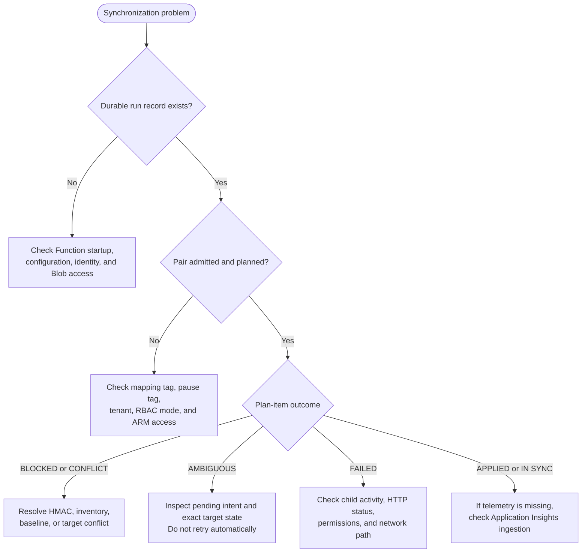

# KeyVaultSync Troubleshooting

## Fast Triage

Start with the durable Blob run record. Telemetry helps locate a failure, but it is not the authoritative mutation record.

## Telemetry Does Not Appear

1. Check the startup log: Azure Monitor export must be enabled.
2. Confirm `APPLICATIONINSIGHTS_CONNECTION_STRING` points to the intended workspace-based Application Insights component; never print the value into terminal logs or tickets.
3. Confirm the app identity can get an Entra token and has `Monitoring Metrics Publisher` on that component.
4. Confirm the component has ingestion enabled and that the app can reach its ingestion endpoint.
5. Query `AppTraces`, `AppDependencies`, and `AppMetrics` in the component's linked Log Analytics workspace. Ingestion may take several minutes.

## Missing Blob Access

- Verify `KEYVAULTSYNC_STORAGE_ACCOUNT_URI` and the selected container names.
- Confirm the runtime identity has `Storage Blob Data Owner` on the shared storage account. The role covers Function deployment/host coordination and the `keyvaultsync-state` and `keyvaultsync-runs` containers.
- If package publication cannot reach shared storage, verify both Blob authorization and network reachability. The root `predeploy` hook checks the network requirement; changing data roles does not change endpoint reachability.
- State writes require a valid pair lease and matching ETag. A lease-renewal or checkpoint failure must fail the pair and must not advance its checkpoint.
- Confirm the principal running the ARM deployment has `Owner` on the deployment resource group and `Storage Blob Data Owner` on shared storage after provisioning. Role propagation may delay Blob operations.

## Object Synchronization Is Blocked

- Confirm the pair has an enabled source/target mapping and neither vault has `KeyVaultSyncDisabled=true`.
- For certificates, confirm the source policy marks the private key exportable and the version-matched backing secret contains a valid PFX. A non-exportable certificate requires reissuance or external import into the target.
- A standalone private or symmetric key requires independent generation or external import into the target. Once a same-named target key exists, allowlisted key-scope RBAC can converge, but KeyVaultSync cannot verify private-key equivalence.
- Confirm the deployed `KEYVAULTSYNC_HMAC_KEY` came from the intended active azd environment and is the same stable Base64-encoded 32-byte key used for existing baselines. Do not print it to compare values; a different key can invalidate baseline checks. `KEYVAULTSYNC_HMAC_KEY_VERSION` is a non-secret baseline-version label, not an enable switch; do not log or copy the key into tickets or state.
- Ensure this runner is the sole writer to target objects being changed. There is no runtime single-writer acknowledgment switch or Key Vault compare-and-set write.
- A missing HMAC key blocks object writes. Run the deployment-preparation hook interactively to supply or generate the initial key, or provide it through protected pipeline configuration. Never generate a replacement for an environment with committed baselines.
- A pending intent means the previous write may have succeeded. Inspect the target's active versions and value/metadata fingerprints through the approved recovery process; never clear the intent or retry based only on timeout.
- A certificate stuck at `AMBIGUOUS_OUTCOME_UNRESOLVED_INTENT` with the detail `The exact written version did not match the expected signature` predates the deterministic certificate signature contract. Earlier builds signed the exported PKCS#12 container, which Key Vault re-encodes non-deterministically, so the post-write check could never match and no certificate baseline was ever committed. Recovery requires both steps, because the planner never adopts an existing target implicitly: clear that single pending intent, then remove the unbaselined target certificate (soft delete and purge, since a soft-deleted name reports `BLOCKED_SOFT_DELETED_TARGET` and is never purged automatically). The next run then plans a clean create and commits a verified baseline. Confirm the target thumbprint matches the source first, and perform both steps through the approved recovery process.
- An unbaselined target or unexpected target version is a conflict. Do not adopt, overwrite, or rebaseline automatically.

## Incomplete Inventory

A partial/failed scan is not deletion evidence. Check the child activity for the failing stage (secrets, keys, certificates, deleted objects, authorization, ARM discovery, or Blob state) and resolve permissions/network/timeout issues before the next complete checkpoint. Existing run history in Blob remains the durable record even when telemetry arrives late.

## A Vault Is Not Being Synchronized

Check the source and target Key Vault ARM tags for `KeyVaultSyncDisabled=true`. The tag is a deliberate pair-level opt-out and is reported in the run record as a disabled vault, not as a mapping failure. Remove the tag or change its value away from `true`, then wait for the next scheduled run. Re-enabling does not clear pending-write intents or bypass HMAC/baseline conflicts.
